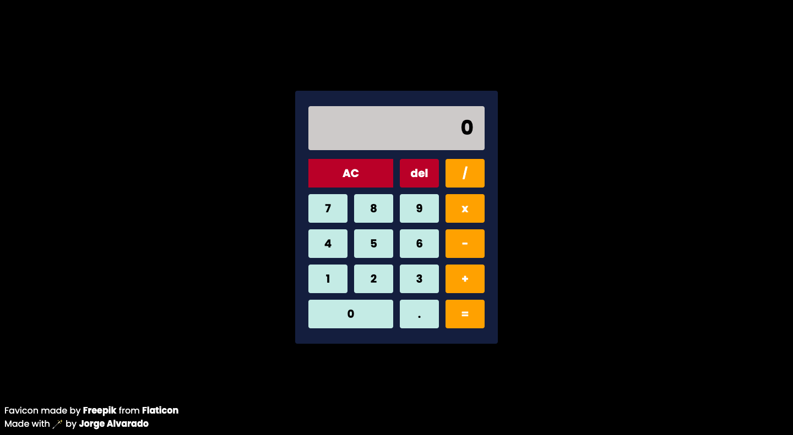

# About The Project

[Demo](https://ca1cu1at3r.netlify.app/)

[The Odin Project Foundations Course JavaScript Section Final Project](https://www.theodinproject.com/lessons/foundations-calculator) consisted of making a Calculator with basic operations and additional extra credit challenges! This was the perfect project to test out my new superpowers! After a few hours of struggle and moments of staring into the screen, I'm really proud to say that I managed to wire things together and bring this to life.

## The Calculator can

- Perform basic operations
- Handle decimals and round results
- Chain multiple operations
- Clear results and delete an unwanted selection
- Handle uncommon and unwanted operations with error messages

## Built With

- Tailwind
- JavaScript
